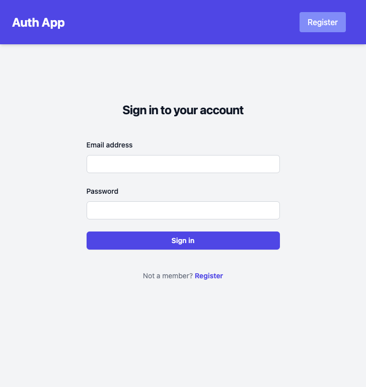
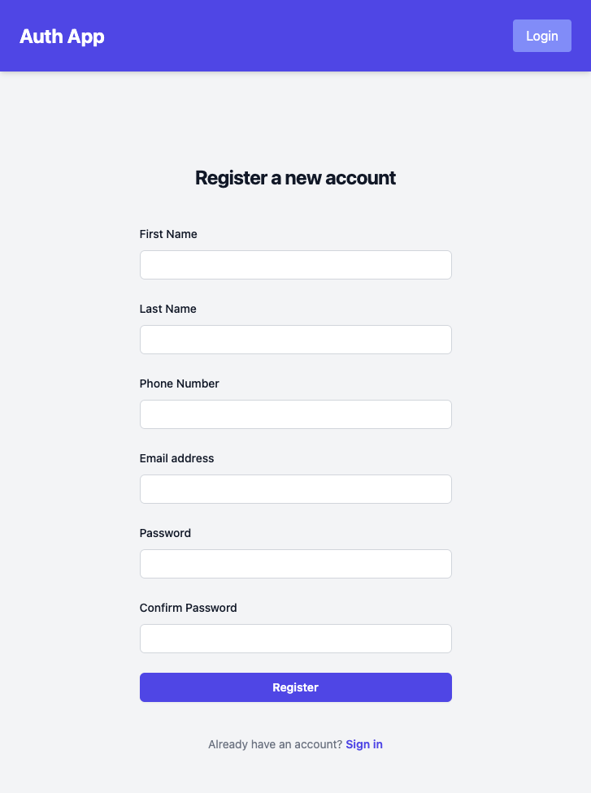
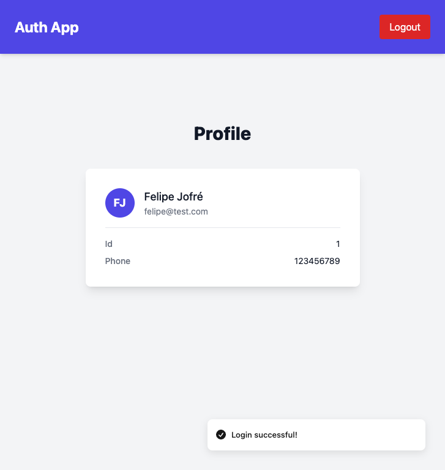

# Desafío Auth Laravel + Tailwind + Vue

El presente proyecto consiste en el desarrollo de una aplicación de autenticación utilizando **Laravel** 🛠️, **Tailwind CSS** 🎨 y **Vue.js** ⚙️. La app incluye las siguientes funcionalidades:

- **Registro de usuarios:** 📝 Los usuarios pueden registrarse en la aplicación.
- **Inicio de sesión:** 🔐 Los usuarios pueden iniciar sesión con sus credenciales.
- **Cierre de sesión:** 🚪 Los usuarios pueden cerrar su sesión.
- **Perfil de usuario:** 👤 Los usuarios pueden visualizar su información personal en la sección de perfil.

---

## Rutas backend - Laravel

| Método | Ruta          | Descripción          | Autenticación     | Cuerpo de la solicitud                                                                                                                                          |
|--------|---------------|----------------------|-------------------|-----------------------------------------------------------------------------------------------------------------------------------------------------------------|
| POST   | /api/login    | Inicio de sesión     | No                | `json { "email": "string", "password": "string" } `                                                                                                             |
| POST   | /api/register | Registro de usuarios | No                | `json { "first_name": "string", "last_name": "string", "phone_number": "string", "email": "string", "password": "string", "password_confirmation": "string" } ` |
| GET    | /api/user     | Ver perfil           | Sí (Bearer token) | N/A                                                                                                                                                             |
| POST   | /api/logout   | Cierre de sesión     | Sí (Bearer token) | N/A                                                                                                                                                             |

---

## Rutas frontend 

- `/` - Página de inicio de sesión
- `/register` - Página de registro
- `/profile` - Página de perfil

---

## Requisitos para desarrollo

Para ejecutar este proyecto, es necesario contar con las siguientes herramientas 🛠️:

- **PHP** 8.2 o superior
- **Composer**
- **Node.js** 20 o superior
- **NPM** 10 o superior (o gestor de paquetes similar)

El proyecto fue desarrollado utilizando **Laravel 11.x** y **Vue 3.x**.

---

## Guía de despliegue - Entorno de desarrollo

Para revisar el proyecto localmente, sigue estos pasos 🧪:

1. Clona el repositorio:

   ```bash
   git clone https://github.com/felipejoq/auth-app-laravel-vue.git
   cd auth-app-laravel-vue
   ```

2. Instala las dependencias de PHP:

   ```bash
   composer install
   ```

3. Instala las dependencias de Node.js:

   ```bash
   npm install
   ```

4. Copia el archivo de configuración:

   ```bash
   cp .env.example .env
   ```

5. Configura la base de datos (ya preparada para SQLite por defecto).

6. Genera la clave de aplicación:

   ```bash
   php artisan key:generate
   ```

7. Ejecuta las migraciones de la base de datos:

   ```bash
   php artisan migrate
   ```

8. Inicia el servidor de desarrollo de Laravel:

   ```bash
   php artisan serve
   ```

9. Compila los assets de Vue:

   ```bash
   npm run dev
   ```

10. Accede a la aplicación en tu navegador:

    - URL principal: `http://localhost:8000`
    - Endpoints de la API: `http://localhost:8000/api`

11. Prueba las funcionalidades de la app:

    - Registro
    - Inicio de sesión
    - Ver perfil
    - Cierre de sesión

---

## 🖼️ Capturas de pantalla

### Página de inicio de sesión



### Página de registro



### Página de perfil



---

Gracias por la oportunidad de participar de este proceso. Considerando que no había tenido experiencias recientes con Laravel y Vue, me sentí muy cómodo y motivado aprendiendo a desarrollar este desafío 🚀.
